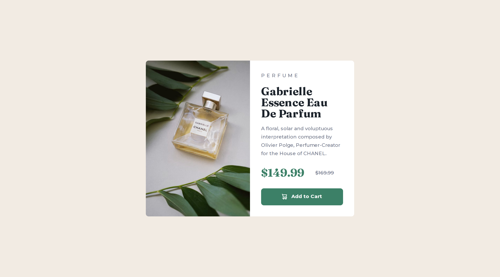

# Frontend Mentor - Product preview card component solution

This is a solution to the [Product preview card component challenge on Frontend Mentor](https://www.frontendmentor.io/challenges/product-preview-card-component-GO7UmttRfa). Frontend Mentor challenges help you improve your coding skills by building realistic projects. 

## Table of contents

- [Overview](#overview)
  - [The challenge](#the-challenge)
  - [Screenshot](#screenshot)
  - [Links](#links)
- [My process](#my-process)
  - [Built with](#built-with)
  - [What I learned](#what-i-learned)
- [Author](#author)

## Overview

### The challenge

Users should be able to:

- View the optimal layout depending on their device's screen size
- See hover and focus states for interactive elements

### Screenshot




### Links

- Live Site URL: [Live Site](https://cheery-lamington-878c24.netlify.app/)

## My process

### Built with

- Semantic HTML5 markup
- CSS custom properties
- Flexbox
- CSS Grid


### What I learned

I learned how to use the ```<picture>``` tag in html to have different image on mobile and desktop.

```html
 <picture class="img">
      <source srcset="images/image-product-desktop.jpg" media="(min-width: 600px)">
      
    </picture>
```


## Author

- Frontend Mentor - [@Mitko90](https://www.frontendmentor.io/profile/Mitko90)


